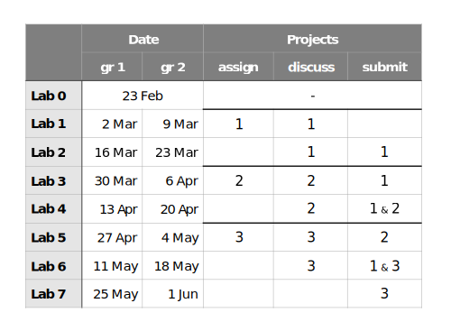
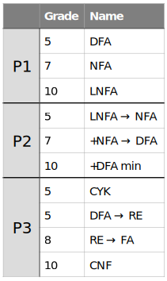

# Labs

<ul class="posts">
  
    <li>
    
      <small class="post-date">{{ post.date | date: '%-d %b' }}</small>
    
      <small class="post-date">{{ post.date | date: '%-d %b' }}, {{ post.date | date:'%s' | plus: 604800 | date: '%-d %b'}}</small>
    
      <a href="{{ site.baseurl }}{{ post.url }}" class="post-link">{{ post.title }}</a>
      {{ post.tagline }}
    </li>
  
</ul>

# Administration

The lab activity will consist of implementing **3 projects**. You can chose the subject for each of them (choices listed below).

During the labs, we will discuss the projects and afterwards you will submit your solution (timetable listed below).

**Evaluation**: each project will receive a 1—10 grade, the final grade is their average. *Exceptional* project implementations can receive up to 12. Bonuses can be awarded for class work.

**Timetable**:

> *Note:* I'll be unavailable on 13 Apr and Easter break falls on 20 Apr.

**Project choices**:

For each project (P1, P2, P3) you can chose to implement any of the following:

Each project can get you a maximum grade indicated in the "Grade" column.

**Programming languages**: you can implement the projects in any language you want. I highly recommend **C++** as it will also help you in your OOP course. Examples will be given in C++ as well.

**Attendance**: mandatory (at least for project submission). You can attent any lab in any week, just make sure to submit all of your projects.

## Links

Attendance, projects and grades: [bit.ly/lab-lfa](http://bit.ly/lab-lfa) (Gr 134 & 135)

Moodle: [moodle.fmi.unibuc.ro/course/view.php?=id=432](http://moodle.fmi.unibuc.ro/enrol/index.php?id=432)

## Contact

Stefan Niculae (Teaching Assistant) — stefan1niculae@gmail.com

Andrei Paun (Professor) — apaun@fmi.unibuc.ro
